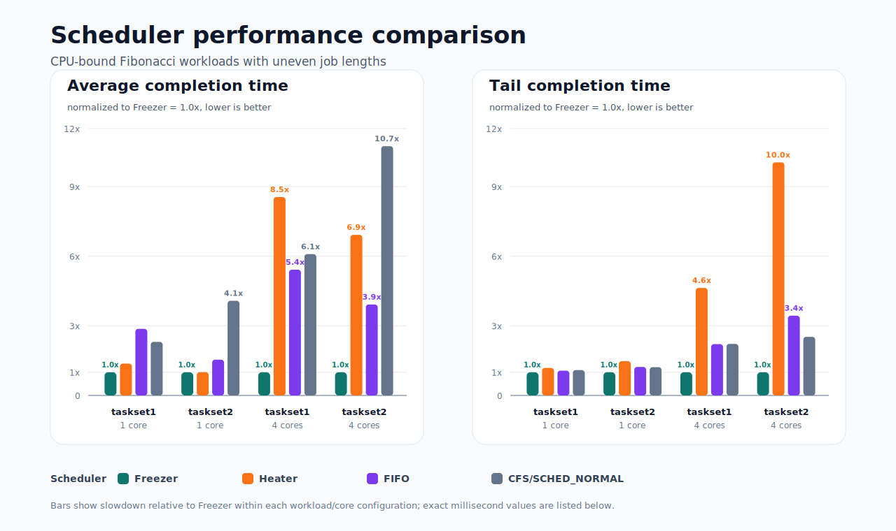

# Freezer Scheduler

Freezer is a custom Linux scheduler class built for computationally intensive workloads with uneven job lengths. The motivating benchmark launches many CPU-bound Fibonacci jobs whose runtimes vary widely, so the main failure mode is convoying: one long-running job can sit ahead of shorter jobs and inflate their completion times.

The scheduler uses fixed 100 ms round-robin time slices to give shorter jobs regular CPU access while keeping slices coarse enough to preserve cache locality and avoid excessive accounting overhead. On multicore systems, Freezer assigns new tasks to the CPU with the fewest Freezer tasks and performs idle-core work stealing from busy CPUs, improving utilization without relying on the default scheduler's balancing logic.

## What This Includes

- `kernel/sched/freezer.c`: `SCHED_FREEZER`, a preemptive round-robin scheduler class with per-CPU run queues, fixed time slices, CPU-aware placement, and idle load balancing.
- `kernel/sched/heater.c`: `SCHED_HEATER`, a comparison scheduler using a global queue and non-preemptive execution.
- `user/trace.bt`: an eBPF/bpftrace profiler that records run-queue latency and total task completion time.
- `user/fibonacci.c` and `user/run_tasks.sh`: CPU-bound benchmark workloads used to compare scheduler behavior.

## Design

Freezer targets batches of equal-priority CPU-bound tasks where fairness machinery is less useful than predictable sharing. A 100 ms time slice prevents a very long Fibonacci job from monopolizing a CPU, while avoiding the overhead and noise that can come from very fine-grained preemption. This makes the scheduler a better fit for workloads where completion time and tail behavior matter more than interactive responsiveness.

The multicore path has two pieces. First, new Freezer tasks are placed on the least-loaded CPU by Freezer run-queue depth. Second, when a CPU is about to go idle, it attempts to steal a movable Freezer task from the busiest CPU, while respecting CPU affinity, per-CPU kernel threads, and currently running tasks.

## Measurement

The benchmark records two metrics:

- Average completion time: mean end-to-end runtime across jobs.
- Tail completion time: the 99th-percentile-style completion bound used to capture long outliers.

The eBPF tracer measures run-queue delay and total completion time directly from scheduler tracepoints, printing one CSV row per process exit.

## Results

Lower is better. Times are in milliseconds.

The chart normalizes each workload/core configuration to Freezer as the 1.0x baseline, so taller bars show how many times slower each scheduler was for the same benchmark.

| Scheduler | Workload | Cores | Average | Tail |
| --- | --- | ---: | ---: | ---: |
| Freezer | taskset1 | 1 | 848.84 | 3293 |
| Heater | taskset1 | 1 | 1164.49 | 3907 |
| FIFO | taskset1 | 1 | 2435.80 | 3523 |
| CFS/SCHED_NORMAL | taskset1 | 1 | 1959.45 | 3600 |
| Freezer | taskset2 | 1 | 330.88 | 1481 |
| Heater | taskset2 | 1 | 331.65 | 2189 |
| FIFO | taskset2 | 1 | 510.34 | 1821 |
| CFS/SCHED_NORMAL | taskset2 | 1 | 1350.18 | 1804 |
| Freezer | taskset1 | 4 | 271.41 | 1570 |
| Heater | taskset1 | 4 | 2320.21 | 7276 |
| FIFO | taskset1 | 4 | 1470.66 | 3474 |
| CFS/SCHED_NORMAL | taskset1 | 4 | 1652.61 | 3490 |
| Freezer | taskset2 | 4 | 123.73 | 526 |
| Heater | taskset2 | 4 | 856.22 | 5283 |
| FIFO | taskset2 | 4 | 485.10 | 1809 |
| CFS/SCHED_NORMAL | taskset2 | 4 | 1329.00 | 1329.18 |

Freezer produced the best average and tail completion times on the tested CPU-bound workloads, outperforming CFS/SCHED_NORMAL and FIFO. FIFO performs poorly when job lengths vary because it effectively lets a long CPU-bound job run until completion, making shorter jobs wait behind it. Freezer turns that behavior into regular sharing, and on multicore runs it further improves throughput by spreading work across CPUs and stealing from busy queues when cores become idle.

Heater was useful as a contrast point: its global-queue design is simple, but the shared queue becomes a bottleneck under multicore CPU-bound pressure, leading to worse average and tail completion times.
